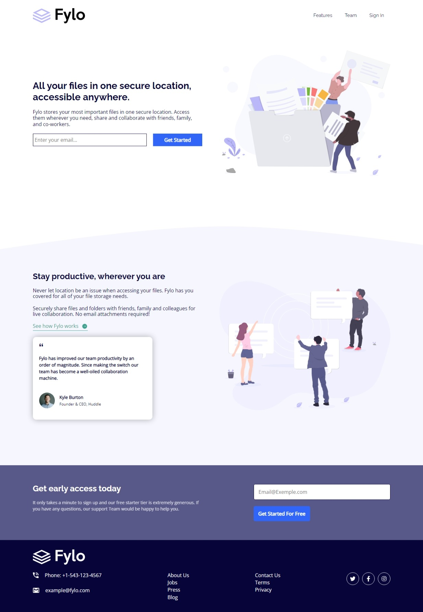
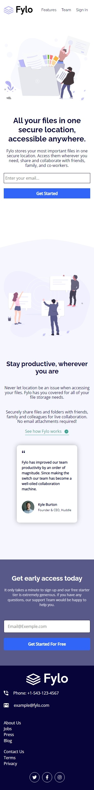

# Frontend Mentor - Fylo landing page with two column layout solution

This is a solution to the [Fylo landing page with two column layout challenge on Frontend Mentor](https://www.frontendmentor.io/challenges/fylo-landing-page-with-two-column-layout-5ca5ef041e82137ec91a50f5). Frontend Mentor challenges help you improve your coding skills by building realistic projects.

## Overview

### The challenge

Users should be able to:

- View the optimal layout for the site depending on their device's screen size (1440px and 350px)
- See hover states for all interactive elements on the page

### Screenshots

#### Desktop Screenshot(1440px)

#### Mobile Screenshot(350px)

## My process

### Built with

- Semantic HTML5 markup
- CSS custom properties
- Flexbox
- CSS Grid

### What I learned

I learned how to change a color of an svg element with fill

## Author

- Frontend Mentor - [@HAKIKI_Ahmed_Djeber](https://www.frontendmentor.io/profile/HakikiAhmedDjeber)
- Github - [@HAKIKI_Ahmed_Djeber](https://github.com/HakikiAhmedDjeber)
